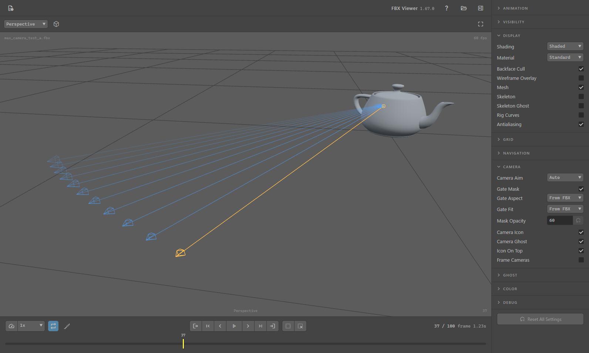
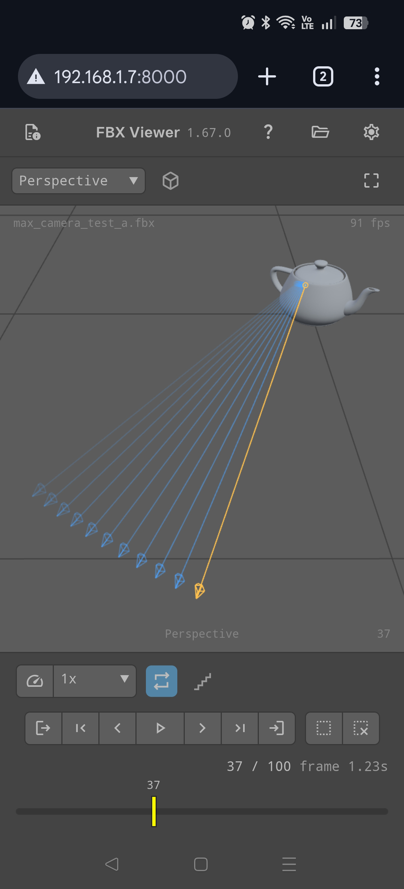
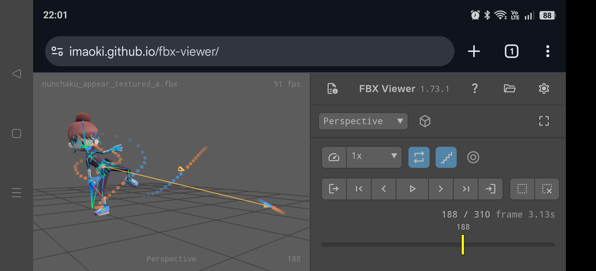

# FBX Viewer

区間再生可能なブラウザ向けFBXアニメーションビューア。

https://imaoki.github.io/fbx-viewer/

インストールは不要で、ファイルはブラウザ内で読まれるだけです。どこかへ送信されることはありません。

## 機能

- **アニメーション再生**

  連続/1回/折り返しの再生モード切り替え、0.25〜2倍速、フレームスナップ、再生区間の設定に対応。

- **カメラの再現**

  焦点距離アニメーション、ロール、エイム拘束、解像度ゲートの表示に対応。

- **オニオンスキン**

  スケルトンとカメラのゴースト表示に対応。

- **オブジェクト単位の可視性**

  表示/非表示/可視性アニメーションの切り替えに対応。

- **標準的なビューポート機能**

  Maya風の視点操作、多数の視点プリセットと透視/平行投影の切り替えをサポートし、スマホ操作にも対応。

## 使い方

- 上記のURLをブラウザで開くか、最新リリースの`fbx-viewer-<version>.html`をダウンロードしてブラウザで開いてください。`file://`のままで動作します。
- テクスチャはFBXに埋め込んで書き出してください。外部ファイルへの参照は読み込みません。
- その他、本ツール特有の機能に関する詳細は **?** ボタンから確認できます。

## 依存しているもの

CDNから取得するため、初回のみ接続が必要です。

- [three.js](https://threejs.org/)
- [Material Symbols](https://fonts.google.com/icons)

## 動作確認

- Chrome、Firefox、Edge
- FBX 7.x、バイナリとアスキー、Mayaおよび3ds Maxからの書き出し

## ライセンス

[MIT License](LICENSE)
